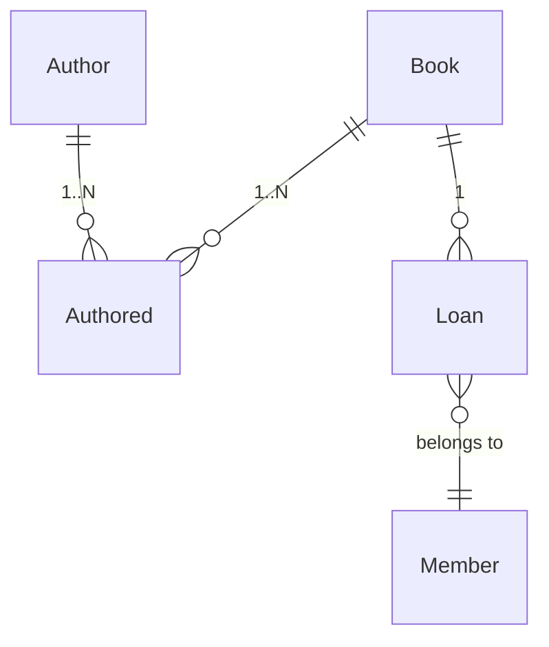
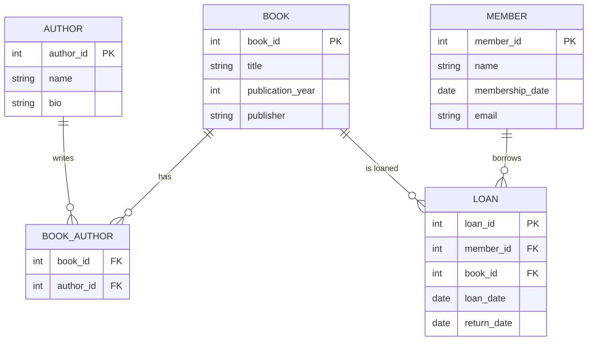

## 1. Conceptual Design: Entity‑Relationship Diagram (ERD)

**Entities and Their Attributes**

- **Book**

  - Attributes: `book_id` (Primary Key), `title`, `publication_year`, `publisher`

- **Author**

  - Attributes: `author_id` (Primary Key), `name`, `bio`

- **Member**

  - Attributes: `member_id` (Primary Key), `name`, `membership_date`, `email`

- **Loan**
  - Attributes: `loan_id` (Primary Key), `loan_date`, `return_date`

**Relationships**

- **Book–Author (Many-to-Many):**  
  A book can have multiple authors and an author can write multiple books.  
  _Resolution:_ Create an associative (junction) table `Book_Author` with:

  - Attributes: `book_id` (Foreign Key), `author_id` (Foreign Key)
  - Composite Primary Key: (`book_id`, `author_id`)

- **Member–Loan–Book (One-to-Many):**  
  A member can borrow many books, and each loan record links one book to one member.  
  _Resolution:_ The `Loan` table includes foreign keys referencing `Member` and `Book`.

_A rough ER diagram might look like:_



---

## 2. Logical Design: Relational Model Diagram

Based on the ERD, the relational model will consist of the following tables:

- **Book**(`book_id`, `title`, `publication_year`, `publisher`)
- **Author**(`author_id`, `name`, `bio`)
- **Book_Author**(`book_id`, `author_id`)  
  _Primary Key: (`book_id`, `author_id`); Foreign Keys: `book_id` references Book, `author_id` references Author._
- **Member**(`member_id`, `name`, `membership_date`, `email`)
- **Loan**(`loan_id`, `member_id`, `book_id`, `loan_date`, `return_date`)  
  _Foreign Keys: `member_id` references Member, `book_id` references Book._



---

## 3. Physical Design: Table Diagram and MySQL Implementation

Below is the MySQL code to create each table with appropriate keys and constraints.

```sql
-- Create Book table
CREATE TABLE Book (
  book_id INT AUTO_INCREMENT PRIMARY KEY,
  title VARCHAR(255) NOT NULL,
  publication_year YEAR,
  publisher VARCHAR(255)
);

-- Create Author table
CREATE TABLE Author (
  author_id INT AUTO_INCREMENT PRIMARY KEY,
  name VARCHAR(255) NOT NULL,
  bio TEXT
);

-- Create Book_Author junction table for many-to-many relationship
CREATE TABLE Book_Author (
  book_id INT,
  author_id INT,
  PRIMARY KEY (book_id, author_id),
  FOREIGN KEY (book_id) REFERENCES Book(book_id),
  FOREIGN KEY (author_id) REFERENCES Author(author_id)
);

-- Create Member table
CREATE TABLE Member (
  member_id INT AUTO_INCREMENT PRIMARY KEY,
  name VARCHAR(255) NOT NULL,
  membership_date DATE,
  email VARCHAR(255)
);

-- Create Loan table
CREATE TABLE Loan (
  loan_id INT AUTO_INCREMENT PRIMARY KEY,
  member_id INT,
  book_id INT,
  loan_date DATE,
  return_date DATE,
  FOREIGN KEY (member_id) REFERENCES Member(member_id),
  FOREIGN KEY (book_id) REFERENCES Book(book_id)
);
```

---

## 4. Working with the Database in MySQL

### a. Inserting Data

**Insert Books:**

```sql
INSERT INTO Book (title, publication_year, publisher)
VALUES
  ('The Great Gatsby', 1925, 'Charles Scribner\'s Sons'),
  ('1984', 1949, 'Secker & Warburg');
```

**Insert Authors:**

```sql
INSERT INTO Author (name, bio)
VALUES
  ('F. Scott Fitzgerald', 'American novelist known for The Great Gatsby'),
  ('George Orwell', 'English novelist, essayist, journalist, and critic');
```

**Link Books and Authors (Book_Author):**

```sql
-- Link 'The Great Gatsby' with F. Scott Fitzgerald
INSERT INTO Book_Author (book_id, author_id) VALUES (1, 1);

-- Link '1984' with George Orwell
INSERT INTO Book_Author (book_id, author_id) VALUES (2, 2);
```

**Insert Members:**

```sql
INSERT INTO Member (name, membership_date, email)
VALUES
  ('John Doe', '2025-01-15', 'john.doe@example.com'),
  ('Jane Smith', '2025-02-20', 'jane.smith@example.com');
```

**Insert Loans:**

```sql
INSERT INTO Loan (member_id, book_id, loan_date, return_date)
VALUES
  (1, 1, '2025-03-01', '2025-03-15'),
  (2, 2, '2025-03-05', NULL);
```

### b. Modifying (Updating) Data

**Example: Update a Book’s Publisher**

```sql
UPDATE Book
SET publisher = 'Scribner'
WHERE book_id = 1;
```

**Example: Update a Member’s Email**

```sql
UPDATE Member
SET email = 'john.newemail@example.com'
WHERE member_id = 1;
```

### c. Deleting Data

**Example: Delete a Loan Record (e.g., cancel a loan)**

```sql
DELETE FROM Loan
WHERE loan_id = 2;
```

**Example: Remove an Author from the `Book_Author` table (e.g., if an association was incorrect)**

```sql
DELETE FROM Book_Author
WHERE book_id = 2 AND author_id = 2;
```

---

## Recap

1. **Conceptual Design:** Define entities (Book, Author, Member, Loan) and relationships (including a many-to-many linking table `Book_Author`).
2. **Logical Design:** Convert the ERD into a relational schema with tables and keys.
3. **Physical Design:** Create SQL table definitions with MySQL, including primary and foreign keys.
4. **Implementation:** Insert sample data, perform updates (modify data), and delete records.
